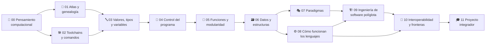

<div align="center">

# 🌐 Polyglot Programming Labs

## **12 partes · 176 clases · 1360 implementaciones verificadas · un concepto, diez lenguajes**

**Programa comparado y verificable para aprender los conocimientos transferibles de la
programación: pensamiento computacional, valores y tipos, control, funciones, datos,
paradigmas, runtime, ingeniería, interoperabilidad y un proyecto integrador —
cada concepto mostrado una vez y comparado en Python, JavaScript, TypeScript, Java,
C#, Go, Rust, C, SQL y PHP, con un Atlas de 60 fichas de lenguaje y el mismo problema
resuelto además en los 12 lenguajes antiguos que siguen en producción hoy.**

[](https://github.com/vladimiracunadev-create/polyglot-programming-labs/actions/workflows/ci.yml)
[](https://github.com/vladimiracunadev-create/polyglot-programming-labs/actions/workflows/labs.yml)
[](https://github.com/vladimiracunadev-create/polyglot-programming-labs/actions/workflows/security.yml)
[](https://github.com/vladimiracunadev-create/polyglot-programming-labs/actions/workflows/deploy-pages.yml)

[](CHANGELOG.md)
[](classes/README.md)
[](languages.json)
[](scripts/verificar_equivalencia.py)
[](atlas/lenguajes.md)
[](atlas/vivos.md)
[](classes/README.md)
[](LICENSE)

[](classes/README.md)
[](classes/README.md)
[](classes/README.md)
[](classes/README.md)
[](classes/README.md)
[](classes/README.md)
[](classes/README.md)
[](classes/README.md)
[](classes/README.md)
[](classes/README.md)
[](https://vladimiracunadev-create.github.io/polyglot-programming-labs/)

[🌐 **Sitio del curso (vivo)**](https://vladimiracunadev-create.github.io/polyglot-programming-labs/) ·
[📥 **Descargas**](https://github.com/vladimiracunadev-create/polyglot-programming-labs/releases/latest) ·
[📚 Índice de clases](classes/README.md) ·
[🌐 Atlas](atlas/README.md) ·
[🗂️ Las 60 fichas](atlas/lenguajes.md) ·
[🧟 Lenguajes vivos](atlas/vivos.md) ·
[🧭 Rutas](rutas/README.md) ·
[📖 Glosario](glosario/README.md) ·
[📕 Manual PDF](manual/MANUAL.pdf) ·
[🗺️ Atlas PDF](manual/ATLAS.pdf) ·
[📅 Syllabus](docs/syllabus.md) ·
[📓 Changelog](CHANGELOG.md) ·
[🗺️ Roadmap](ROADMAP.md) ·
[🤝 Contribuir](CONTRIBUTING.md) ·
[🔐 Seguridad](SECURITY.md)

<br>

| 📘 Clases | 🌐 Implementaciones | 🧟 Vivos | 🧬 Primos | 🗂️ Fichas | 🧩 Partes | 📖 Glosario | 📝 Preguntas |
|:---:|:---:|:---:|:---:|:---:|:---:|:---:|:---:|
| **176** | **1360** | **1632** | **2722** | **60** | **12** | **424** | **90** |

</div>

---

> [!IMPORTANT]
> Este repositorio **no reemplaza** los cursos de cada lenguaje. Es el mapa de lo que
> **permanece** al cambiar de lenguaje. `Fluent Python`, `Effective Java`,
> `The Rust Programming Language` y compañía aparecen como referencias de profundización
> en cada clase, sin copiar ni falsear su contenido: la redacción aquí es original. Cada
> obra citada está en el [registro de fuentes](sources/bibliography.json) con su ISBN-13 o
> su DOI, para que cualquiera pueda ir a comprobarla.

## ✅ Estado verificable

| Superficie | Estado |
|---|---|
| Currículo | ✅ 176/176 clases construidas — 136 de código (Partes 3–11) y 40 de método (Partes 0–2) |
| Implementaciones | ✅ 1360 del núcleo (136 clases × 10 lenguajes), con el código a la vista en la clase |
| Equivalencia | ✅ verificada en CI: cada implementación se ejecuta contra el `casos.json` de su clase |
| Primos del Atlas | 🟡 2722 programas en 20 lenguajes; Ruby, Perl y Lua se **ejecutan** en CI, los otros 17 son lectura declarada |
| Lenguajes vivos | 🟡 **1632 programas** en las 136 clases de código (12 lenguajes antiguos × 136); COBOL, Fortran, Ada, Pascal, Lisp, Tcl, Perl y C++ se **compilan y ejecutan** en CI contra el mismo `casos.json`, RPG/JCL/VBA/AutoLISP declaran su adaptación del contrato y PL/I, MUMPS, Smalltalk y ensamblador van sin sello de máquina |
| Fichas de lenguaje | 🟡 **60 fichas** en el [Atlas](atlas/lenguajes.md): historia, dónde vive hoy, lo que enseña, lo modernizado, cómo se ejecuta, el programa de la clase 041 explicado y bibliografía — material de lectura, no se ejecuta |
| Atlas de familias | ⚪ 39 cápsulas en 15 familias — material de lectura fechado (rev. 2026-07); no se ejecuta |
| Manual | ✅ 1150 páginas en PDF generadas desde las mismas clases (**4094** con los vivos y los primos), más 238 del volumen del [Atlas](manual/ATLAS.pdf) con las 60 fichas |
| Glosario | ✅ 424 términos derivados de las clases y enlazados a su clase de origen |
| Autoevaluaciones | ✅ 90 preguntas, batería por cada una de las 12 partes |
| Sitio | ✅ portal estático en GitHub Pages con índice, búsqueda y rutas |
| Apps | ✅ APK de Android y ejecutable de Windows, **con el contenido contado dentro del binario** en CI |
| Fuentes | ✅ toda obra citada tiene ISBN-13 o DOI en [`sources/bibliography.json`](sources/bibliography.json), y cada cita declara para qué usa la clase esa obra |
| CI | ✅ estructura y manifest, markdownlint, **fuentes y bibliografía**, equivalencia por lenguaje, secretos (gitleaks) y SAST (bandit) |
| SQL | ⚪ declarativo: se marca como *ilustrativo* en el verificador, no se fuerza a imitar un lenguaje imperativo |

## 🌟 Qué hace diferente a este programa

- Enseña el **concepto una vez** y luego lo compara: la pregunta no es "¿cómo se escribe en X?", sino **"¿qué permanece y qué cambia —y por qué— al pasar de un lenguaje a otro?"**.
- La equivalencia entre lenguajes **la demuestra una máquina**, no una promesa del texto: mismo `casos.json`, mismas salidas, en CI.
- Distingue siempre las **tres clases de diferencia**: sintáctica, semántica y paradigmática — la mayoría de los cursos mezclan las tres.
- Separa el **núcleo** (se implementa y se verifica) del **Atlas** (se comprende por características), y no vende lo segundo como lo primero.
- Ancla cada parte en la **literatura de referencia** de su área, con la cita en la clase.
- Declara sin adornos **qué verifica la máquina y qué es material de lectura**.

## 🧬 El mapa del programa



## 🗂️ Las 12 partes, en 5 etapas

Cada parte tiene su **propio README docente**, y no un índice de enlaces: de qué trata,
qué necesitas traer, qué sabrás hacer al terminar, **qué se aprende en cada una de sus
clases** agrupadas por bloques, los malentendidos que corrige y los libros que la
sostienen. La numeración es **global y secuencial** por diseño: lo que enseña cada parte
es el prerrequisito real de la siguiente.

### 🟢 Etapa 1 — Método y mapa *(clases de método)*

Cómo se compara un lenguaje con otro, de dónde vienen todos y con qué se ejecutan.
**Salida: leer código de un lenguaje que no conoces.**

| # | Parte | Clases | Rango | Tipo | Horas |
|---:|---|---:|---|---|---:|
| 0 | [🧠 Pensamiento computacional y el método políglota](classes/parte-0-pensamiento-computacional-y-el-metodo-poliglota/README.md) | 14 | 001–014 | método | ~21 |
| 1 | [🌳 Atlas y genealogía de los lenguajes](classes/parte-1-atlas-y-genealogia-de-los-lenguajes/README.md) | 14 | 015–028 | método | ~21 |
| 2 | [🛠️ Herramientas, toolchains y anatomía de comandos](classes/parte-2-herramientas-toolchains-y-anatomia-de-comandos/README.md) | 12 | 029–040 | método | ~18 |

### 🔵 Etapa 2 — El programa elemental

Los tres ladrillos que todo lenguaje tiene: qué es un valor, cómo se decide y cómo se
nombra un bloque de trabajo. **Salida: escribir el mismo programa correcto en diez lenguajes.**

| # | Parte | Clases | Rango | Tipo | Horas |
|---:|---|---:|---|---|---:|
| 3 | [🔤 Valores, tipos y variables](classes/parte-3-valores-tipos-y-variables/README.md) | 16 | 041–056 | código | ~40 |
| 4 | [🔀 Control del programa](classes/parte-4-control-del-programa/README.md) | 16 | 057–072 | código | ~40 |
| 5 | [🧩 Funciones y modularidad](classes/parte-5-funciones-y-modularidad/README.md) | 16 | 073–088 | código | ~40 |

### 🟣 Etapa 3 — Datos y paradigmas

De guardar un dato a elegir un estilo de resolver: OO, funcional, declarativo, concurrente.
**Salida: reconocer el paradigma detrás de una API y su coste.**

| # | Parte | Clases | Rango | Tipo | Horas |
|---:|---|---:|---|---|---:|
| 6 | [🗃️ Datos y estructuras](classes/parte-6-datos-y-estructuras/README.md) | 18 | 089–106 | código | ~45 |
| 7 | [🎭 Paradigmas](classes/parte-7-paradigmas/README.md) | 16 | 107–122 | código | ~40 |

### 🟠 Etapa 4 — Máquina e ingeniería

Qué ocurre bajo el código (memoria, GC, propiedad, compilación) y cómo se construye
software que otros mantienen. **Salida: explicar el porqué, no solo el cómo.**

| # | Parte | Clases | Rango | Tipo | Horas |
|---:|---|---:|---|---|---:|
| 8 | [⚙️ Cómo funcionan los lenguajes](classes/parte-8-como-funcionan-los-lenguajes/README.md) | 16 | 123–138 | código | ~40 |
| 9 | [🏗️ Ingeniería de software políglota](classes/parte-9-ingenieria-de-software-poliglota/README.md) | 16 | 139–154 | código | ~40 |

### 🔴 Etapa 5 — Fronteras y proyecto

Dónde se tocan dos lenguajes distintos y el trabajo que junta las once partes anteriores.
**Salida: montar un sistema real con más de un lenguaje y defenderlo.**

| # | Parte | Clases | Rango | Tipo | Horas |
|---:|---|---:|---|---|---:|
| 10 | [🔌 Interoperabilidad y fronteras entre lenguajes](classes/parte-10-interoperabilidad-y-fronteras-entre-lenguajes/README.md) | 10 | 155–164 | código | ~25 |
| 11 | [🎓 Proyecto integrador políglota](classes/parte-11-proyecto-integrador-poliglota/README.md) | 12 | 165–176 | proyecto | ~36 |

➡️ **[Ver el índice completo de las 176 clases](classes/README.md)** · 📅 **[Cronograma de ~406 h / ~41 semanas](docs/syllabus.md)**

## 🚀 Inicio rápido

```bash
git clone https://github.com/vladimiracunadev-create/polyglot-programming-labs.git
cd polyglot-programming-labs

python scripts/validar_estructura.py            # el repo cuadra con el manifest
python scripts/verificar_equivalencia.py 041    # una clase, en todos los lenguajes instalados
python scripts/verificar_equivalencia.py --all --lang go   # solo un lenguaje, todas las clases
```

No hace falta instalar nada más para **leer**: cada clase muestra el código de los diez
lenguajes a la vista, en su `README.md`.

Sitio local:

```bash
python scripts/generar_sitio.py && python -m http.server 8080
```

Abre `http://localhost:8080/site/`.

## 🧪 El verificador de equivalencia

El diferenciador del programa: cada clase de código define un `casos.json` (entradas y
salidas comunes), y el verificador ejecuta **todas** las implementaciones alimentándolas
por stdin para comprobar que **coinciden**. No es teoría: es equivalencia demostrada por
máquina, en paralelo por lenguaje en CI.

```bash
python scripts/verificar_equivalencia.py 041            # una clase
python scripts/verificar_equivalencia.py --all          # todas las clases
python scripts/verificar_primos.py --all --lang ruby    # los primos del Atlas que sí se ejecutan
```

Los lenguajes cuyo toolchain no esté instalado se **omiten e informan** (degradación
silenciosa, nunca un falso verde); SQL, al ser declarativo, se marca como *ilustrativo*.

## 📥 El curso en cinco formatos

El mismo contenido, generado siempre desde las mismas clases. Todo en el
**[último release](https://github.com/vladimiracunadev-create/polyglot-programming-labs/releases/latest)**.

| Formato | Qué es | Dónde |
|---|---|---|
| 🌐 **Web** | El portal con búsqueda, rutas y progreso local. Siempre al día. | [Sitio del curso](https://vladimiracunadev-create.github.io/polyglot-programming-labs/) |
| 📱 **Android** | Las 344 páginas embebidas, sin conexión ni cuenta. | [`.apk`](https://github.com/vladimiracunadev-create/polyglot-programming-labs/releases/latest) · [cómo está hecha](apps/android/README.md) |
| 💻 **Windows** | Ejecutable único: sirve el curso en `127.0.0.1` y lo abre en tu navegador. | [`.exe`](https://github.com/vladimiracunadev-create/polyglot-programming-labs/releases/latest) · [cómo está hecha](apps/desktop/README.md) |
| 📕 **PDF del curso** | Para imprimir o leer de corrido, con el código de los diez lenguajes a la vista. | [Manual (1150 pág.)](manual/MANUAL.pdf) · [Completo, con vivos y primos (4094 pág.)](https://github.com/vladimiracunadev-create/polyglot-programming-labs/releases/latest) |
| 🗺️ **PDF del Atlas** | Las 60 fichas de lenguaje en un volumen aparte, con sus dos índices. | [Atlas (238 pág.)](manual/ATLAS.pdf) |

> 🔍 **Las apps se verifican por dentro.** Un APK sin curso compila igual y un `.exe` sin
> datos arranca igual: todas las señales de build quedan verdes. Por eso
> [`android.yml`](.github/workflows/android.yml) descomprime el APK y
> [`desktop.yml`](.github/workflows/desktop.yml) lee el índice del ejecutable, y **cuentan**
> las 176 páginas de clase y los 136 anexos antes de publicar nada.

Regenerar cualquiera de ellos desde el repositorio:

```bash
python scripts/generar_sitio.py                # el portal HTML (site/), base de las apps
python scripts/generar_manual.py               # manual/MANUAL.pdf
python scripts/generar_manual.py --atlas       # manual/ATLAS.pdf, las 60 fichas
python scripts/generar_manual.py --con-vivos --con-primos --salida manual/MANUAL-COMPLETO.pdf
python scripts/generar_material.py --parte 3   # guías sueltas por clase en material/
```

## 📦 Contrato de una clase

```text
classes/parte-N-slug/NNN-topic/
├── README.md            ← la clase completa, con el código de los 10 lenguajes a la vista
├── concepto.md
├── comparacion.md       ← sintáctica · semántica · paradigmática
├── reto.md              ← reto de transferencia
├── primos.md            ← el mismo programa en los lenguajes primos de cada familia
├── vivos.md             ← el mismo programa en los 12 lenguajes que siguen en producción
├── casos.json           ← la prueba común que ejecuta el verificador
└── implementaciones/<lenguaje>/...
```

Dentro del `README.md` de cada clase: 🎯 objetivo y resultados verificables · 🗺️ temas con
su porqué · 📖 definiciones · 🧮 modelo (entradas/salidas/reglas) · 📐 pseudocódigo neutral ·
🌐 las 10 implementaciones · 🔬 comparación · 🧬 el concepto en la familia · ✅ prueba común ·
🧪 reto · ⚠️ errores comunes · ❓ FAQ · 🔗 referencias a los libros del área y del lenguaje.

## 📚 Las fuentes: qué se ha leído para escribir esto

El contenido no sale de una plantilla: cada parte sigue la literatura de referencia de su
tema. **No se reproduce el contenido de ninguna obra**: la redacción es original, cada clase
cita el libro que corresponde y **declara para qué lo usa** —no basta con nombrarlo—.

Aquí están **todas** las obras, una por una, con su edición y su localizador, para que
cualquiera pueda ir a comprobarlas. El registro completo, con la lista de clases que citan
cada obra, está en **[`sources/bibliography.json`](sources/bibliography.json)**.

<!-- FUENTES:INICIO — generado por scripts/verificar_fuentes.py; no editar a mano -->

### La obra rectora de cada lenguaje del núcleo

| Lenguaje | Obra rectora | Edición | Año | Editorial | Localizador |
|---|---|---|---|---|---|
| **Python** | Ramalho — *Fluent Python* | 2ª ed. | 2021 | O'Reilly Media | ISBN [`9781492056355`](https://openlibrary.org/isbn/9781492056355) |
| **JavaScript** | Haverbeke — *Eloquent JavaScript* | 3ª ed. | 2018 | No Starch Press | ISBN [`9781593279509`](https://openlibrary.org/isbn/9781593279509)<br>[edición libre](https://eloquentjavascript.net/) |
| **TypeScript** | Cherny — *Programming TypeScript* | — | 2019 | O'Reilly Media | ISBN [`9781492037651`](https://openlibrary.org/isbn/9781492037651) |
| **Java** | Bloch — *Effective Java* | 3ª ed. | 2017 | Addison-Wesley Professional | ISBN [`9780134685991`](https://openlibrary.org/isbn/9780134685991) |
| **C#** | Skeet — *C# in Depth* | 4ª ed. | 2019 | Manning Publications | ISBN [`9781617294532`](https://openlibrary.org/isbn/9781617294532) |
| **Go** | Donovan y Kernighan — *The Go Programming Language* | — | 2016 | Addison-Wesley | ISBN [`9780134190440`](https://openlibrary.org/isbn/9780134190440) |
| **Rust** | Klabnik y Nichols — *The Rust Programming Language* | 2ª ed. | 2023 | No Starch Press | ISBN [`9781718503106`](https://openlibrary.org/isbn/9781718503106)<br>[edición libre](https://doc.rust-lang.org/book/) |
| **C** | Kernighan y Ritchie — *The C Programming Language* | 2ª ed. | 1988 | Prentice Hall | ISBN [`9780131103627`](https://openlibrary.org/isbn/9780131103627) |
| **SQL** | Date — *SQL and Relational Theory* | 3ª ed. | 2015 | O'Reilly Media | ISBN [`9781491941171`](https://openlibrary.org/isbn/9781491941171) |
| **PHP** | Lockhart — *Modern PHP* | — | 2015 | O'Reilly Media | ISBN [`9781491905012`](https://openlibrary.org/isbn/9781491905012) |

### Las obras de área, y en qué partes se usan

| Obra | Edición | Año | Editorial | Localizador | Partes |
|---|---|---|---|---|---|
| Sedgewick y Wayne — *Algorithms* | 4ª ed. | 2011 | Addison-Wesley | ISBN [`9780321573513`](https://openlibrary.org/isbn/9780321573513) | 6 |
| Newman — *Building Microservices* | 2ª ed. | 2020 | O'Reilly Media | ISBN [`9781492034025`](https://openlibrary.org/isbn/9781492034025) | 10, 11 |
| Martin — *Clean Code* | — | 2008 | Prentice Hall | ISBN [`9780132350884`](https://openlibrary.org/isbn/9780132350884) | 0, 5 |
| McConnell — *Code Complete* | 2ª ed. | 2004 | Microsoft Press | ISBN [`9780735619678`](https://openlibrary.org/isbn/9780735619678) | 0, 5, 9 |
| Aho et al. — *Compilers: Principles, Techniques, and Tools* | 2ª ed. | 2006 | Pearson/Addison-Wesley | ISBN [`9780321486813`](https://openlibrary.org/isbn/9780321486813) | 8 |
| Bryant y O'Hallaron — *Computer Systems: A Programmer's Perspective* | 3ª ed. | 2015 | Pearson | ISBN [`9780134092669`](https://openlibrary.org/isbn/9780134092669) | 8 |
| Sebesta — *Concepts of Programming Languages* | 12ª ed. | 2018 | Pearson | ISBN [`9780134997186`](https://openlibrary.org/isbn/9780134997186) | 0, 1, 3, 4, 7 |
| Sebesta — *Concepts of Programming Languages* | 11ª ed. | 2015 | Pearson Education | ISBN [`9780133943023`](https://openlibrary.org/isbn/9780133943023) | 5 |
| Van Roy y Haridi — *Concepts, Techniques, and Models of Computer Programming* | — | 2004 | MIT Press | ISBN [`9780262220699`](https://openlibrary.org/isbn/9780262220699) | 0, 1, 7 |
| Nystrom — *Crafting Interpreters* | — | 2021 | Genever Benning | ISBN [`9780990582939`](https://openlibrary.org/isbn/9780990582939)<br>[edición libre](https://craftinginterpreters.com/) | 8 |
| Gamma et al. — *Design Patterns* | — | 1995 | Addison-Wesley Professional | ISBN [`9780201633610`](https://openlibrary.org/isbn/9780201633610) | 7, 9 |
| Kleppmann — *Designing Data-Intensive Applications* | — | 2017 | O'Reilly Media | ISBN [`9781449373320`](https://openlibrary.org/isbn/9781449373320) | 10 |
| Tanenbaum y Steen — *Distributed Systems* | 3ª ed. | 2017 | Maarten van Steen (edición de autor) | ISBN [`9781543057386`](https://openlibrary.org/isbn/9781543057386) | 10 |
| Polya — *How to Solve It* | — | 2004 | Princeton University Press | ISBN [`9780691119663`](https://openlibrary.org/isbn/9780691119663) | 0 |
| Cormen et al. — *Introduction to Algorithms* | 4ª ed. | 2022 | MIT Press | ISBN [`9780262046305`](https://openlibrary.org/isbn/9780262046305) | 0, 6 |
| Liskov y Guttag — *Program Development in Java: Abstraction, Specification, and Object-Oriented Design* | — | 2000 | Addison-Wesley Professional | ISBN [`9780201657685`](https://openlibrary.org/isbn/9780201657685) | 7 |
| Scott — *Programming Language Pragmatics* | 4ª ed. | 2015 | Morgan Kaufmann | ISBN [`9780124104099`](https://openlibrary.org/isbn/9780124104099) | 1, 3 |
| Fowler — *Refactoring* | 2ª ed. | 2018 | Addison-Wesley | ISBN [`9780134757599`](https://openlibrary.org/isbn/9780134757599) | 9 |
| Nygard — *Release It!* | 2ª ed. | 2018 | Pragmatic Bookshelf | ISBN [`9781680502398`](https://openlibrary.org/isbn/9781680502398) | 10, 11 |
| Tate — *Seven Languages in Seven Weeks* | — | 2010 | Pragmatic Bookshelf | ISBN [`9781934356593`](https://openlibrary.org/isbn/9781934356593) | 1 |
| Abelson et al. — *Structure and Interpretation of Computer Programs* | 2ª ed. | 1996 | MIT Press | ISBN [`9780262510875`](https://openlibrary.org/isbn/9780262510875)<br>[edición libre](https://mitpress.mit.edu/9780262510875/) | 0, 1, 5, 7 |
| Dahl et al. — *Structured Programming* | — | 1972 | Academic Press | ISBN [`9780122005503`](https://openlibrary.org/isbn/9780122005503) | 4, 7 |
| Beck — *Test-Driven Development: By Example* | — | 2002 | Addison-Wesley | ISBN [`9780321146533`](https://openlibrary.org/isbn/9780321146533) | 9 |
| Shotts — *The Linux Command Line* | 2ª ed. | 2019 | No Starch Press | ISBN [`9781593279523`](https://openlibrary.org/isbn/9781593279523)<br>[edición libre](https://linuxcommand.org/tlcl.php) | 2 |
| Hunt y Thomas — *The Pragmatic Programmer* | 2ª ed. | 2019 | Addison-Wesley | ISBN [`9780135957059`](https://openlibrary.org/isbn/9780135957059) | 0, 2, 5, 9, 11 |
| Kernighan y Pike — *The Unix Programming Environment* | — | 1984 | Prentice-Hall | ISBN [`9780139376818`](https://openlibrary.org/isbn/9780139376818) | 2 |
| Pierce — *Types and Programming Languages* | — | 2002 | MIT Press | ISBN [`9780262162098`](https://openlibrary.org/isbn/9780262162098) | 3, 5 |

### Los artículos fundacionales que se citan

| Artículo | Edición | Año | Publicado en | Localizador | Partes |
|---|---|---|---|---|---|
| Hoare — *Communicating Sequential Processes* | — | 1978 | Communications of the ACM 21(8) | DOI [`10.1145/359576.359585`](https://doi.org/10.1145/359576.359585) | 7 |
| Dijkstra — *Go To Statement Considered Harmful* | — | 1968 | Communications of the ACM 11(3) | DOI [`10.1145/362929.362947`](https://doi.org/10.1145/362929.362947) | 7 |
| Parnas — *On the Criteria To Be Used in Decomposing Systems into Modules* | — | 1972 | Communications of the ACM 15(12) | DOI [`10.1145/361598.361623`](https://doi.org/10.1145/361598.361623) | 5, 7 |
| Ungar y Smith — *Self: The Power of Simplicity* | — | 1987 | OOPSLA '87 (ACM) | DOI [`10.1145/38765.38828`](https://doi.org/10.1145/38765.38828) | 7 |

> Estas tablas no se teclean: las escribe `scripts/verificar_fuentes.py` leyendo el registro y las 176 clases. En cada cambio, el CI comprueba que las **41 obras citadas están todas en el registro** y que ninguna entrada sobra, y que cada una de las 1922 citas dice para qué sirve.

<!-- FUENTES:FIN -->

## 🧩 Núcleo, Atlas y lenguajes vivos: tres capas

| Capa | Qué es | Alcance |
|---|---|---|
| **Núcleo** | Se implementa, se muestra a la vista y **se verifica en CI** | Python, JavaScript, TypeScript, Java, C#, Go, Rust, C, SQL, PHP |
| **Atlas** | Se **comprende por características** (historia, paradigma, memoria, toolchain) | 39 cápsulas en 15 familias + **[60 fichas de lenguaje](atlas/lenguajes.md)**, una por cada lenguaje del repositorio |
| **[Lenguajes vivos](atlas/vivos.md)** | Lenguajes antiguos que **siguen en producción**, con ficha propia y **el programa de cada clase** | 18 fichas y **1632 programas**: COBOL, Fortran, Ada, RPG, PL/I, MUMPS, Smalltalk, Lisp, AutoLISP, Tcl, Perl, Delphi, VBA, Pascal, JCL, Assembler, C, C++ |

La idea: **aprende el representante, reconoce la familia entera.** Si dominas C, ya lees el
80 % de la sintaxis de Java, C#, JS, Go y PHP. El **[Atlas](atlas/README.md)** cubre esa
amplitud sin multiplicar el mantenimiento.

> 🗂️ **Cada lenguaje del repositorio tiene ficha propia.** Las
> **[60 fichas](atlas/lenguajes.md)** —los 10 del núcleo incluidos— siguen la misma anatomía:
> historia, dónde vive hoy, **lo que enseña y no enseña ningún otro**, lo que se ha
> modernizado, cómo se ejecuta con órdenes reales, **el programa de la clase 041 explicado
> línea a línea** y bibliografía.

### 🧟 Por qué hay una capa de lenguajes vivos

**No es nostalgia: es profundidad.** Cada uno de esos dieciocho se incluye por dos motivos
verificables — que **se ejecuta hoy en producción** (banca, sanidad, aviónica, diseño de chips,
ERP, CAD, hojas de cálculo) y que **deja a la vista un concepto que el núcleo esconde**: la
aritmética decimal exacta en [COBOL](atlas/cobol.md), el tipo que lleva una regla de negocio en
[Ada](atlas/ada.md), la base de datos que *es* el lenguaje en [MUMPS](atlas/mumps.md), el `if` que
resulta ser un mensaje en [Smalltalk](atlas/smalltalk.md), el código que es un dato en
[Lisp](atlas/common-lisp.md), el bucle principal que escribe el runtime en [RPG](atlas/rpg.md).

Y **muchos se han actualizado para resolver problemas actuales**: COBOL genera JSON con sentencias
del lenguaje, Fortran descarga bucles a la GPU, RPG consume APIs REST, Ada 2022 comprueba contratos,
Perl 5.40 tiene `try/catch`, Delphi compila para iOS y Android. Cada ficha lo detalla en su sección
`🔄 Lo que se ha modernizado`.

Donde un lenguaje **no puede** expresar el problema de una clase —[JCL](atlas/jcl.md) no calcula,
[VBA](atlas/vba.md) vive dentro de Excel, [AutoLISP](atlas/autolisp.md) dentro de AutoCAD— **el
contrato se adapta y la adaptación se declara**, en lugar de inventar un programa falso.

👉 **[Índice de lenguajes que siguen vivos](atlas/vivos.md)**

### 🧬 Los primos: el mismo programa en toda la familia

Cada muestra de código del núcleo enlaza, justo debajo, a las versiones del **mismo programa**
en los lenguajes primos de su familia. Si lees el bloque de Python, ves de inmediato cómo lo
escribirían Ruby, Perl, Lua, Tcl o R:

```markdown
🧬 El mismo programa en la familia Scripting dinámico: Ruby · Perl · Lua · Tcl · R
```

Son **2722 programas en 20 lenguajes**, y lo que da valor a cada página no es el código sino
el párrafo *«Qué reconocer»* que la cierra: que `0` es verdadero en Lua y Clojure, que Lua
hace herencia por `__index` —el mismo modelo de prototipos de JavaScript—, o que el
*name mangling* de C++ no está estandarizado entre compiladores.

Ruby, Perl y Lua **se ejecutan en CI** contra el mismo `casos.json` que el núcleo
([workflow Labs](.github/workflows/labs.yml)); los otros 17 primos son material de lectura y
así se declara en cada página. Verificar tres de veinte no es verificarlos todos.

## 🧭 Portal

- 🧭 **[Rutas por perfil](rutas/README.md)** — "vengo de Python", "quiero sistemas (C/Rust)", "web (JS/TS)", "backend (Java/C#/Go)", "datos (SQL)".
- 🌐 **[Atlas de lenguajes](atlas/README.md)** — genealogía, historia, características y toolchain de cada familia.
- 🧟 **[Lenguajes que siguen vivos](atlas/vivos.md)** — 18 fichas de lenguajes antiguos en producción hoy: dónde se usan, qué han modernizado y qué concepto enseñan.
- 📝 **[Autoevaluaciones](autoevaluaciones/README.md)** — 90 preguntas, una batería por parte, con quiz y progreso local.
- 📖 **[Glosario](glosario/README.md)** — 424 términos enlazados a la clase donde se explican.
- 🧪 **[Laboratorios](labs/README.md)** — la equivalencia demostrada: el verificador sobre las implementaciones.

🌐 Todo navegable en el **[sitio del curso](https://vladimiracunadev-create.github.io/polyglot-programming-labs/)** (GitHub Pages),
y el mismo portal completo dentro de la **[app de Android](apps/android/README.md)** y del
**[ejecutable de escritorio](apps/desktop/README.md)**, sin conexión.

## 👩‍🏫 Para instructores

- 📅 **[Syllabus y cronograma](docs/syllabus.md)** — horas por parte, dependencias y un plan de ~41 semanas.
- 📊 **[Rúbrica de evaluación](docs/rubrica-evaluacion.md)** — cómo puntuar retos de transferencia, laboratorios y el proyecto integrador.
- 🎓 **[Examen final por perfil](docs/examen-final-por-perfil.md)** — teoría + transferencia verificada + explicación, para cada ruta.
- 🧱 **[Currículo](docs/CURRICULO.md)** · **[Metodología](docs/METODOLOGIA.md)** · **[Ampliar lenguajes](docs/EXTENDER.md)**.

## 🗂️ Estructura del repositorio

```text
classes/
  _manifest.json          # fuente de verdad (176 clases)
  README.md               # índice completo
  parte-N-.../
    README.md             # README docente de la parte (generado desde scripts/guias.py)
    NNN-.../              # la clase (ver «Contrato de una clase»)
atlas/  rutas/  autoevaluaciones/  glosario/  labs/   # portal
apps/android/  apps/desktop/                          # el curso empaquetado
manual/  material/  docs/  site/                      # PDF, guías y portal HTML
scripts/  .github/workflows/
```

Todo deriva de [`classes/_manifest.json`](classes/_manifest.json), producido por
[`scripts/build.py`](scripts/build.py) a partir de [`scripts/curriculo.py`](scripts/curriculo.py)
y [`scripts/guias.py`](scripts/guias.py). Re-ejecutar `python scripts/build.py` actualiza
índice y README de parte sin tocar las clases, que se escriben a mano. Qué se edita y qué
se genera está en la [guía de contribución](CONTRIBUTING.md#qué-se-edita-a-mano-y-qué-se-genera).

## 🚀 Cómo estudiar

```text
problema → concepto → pseudocódigo → implementaciones → comparación → transferencia
```

1. **Sigue el orden.** Empieza por la [Parte 0](classes/parte-0-pensamiento-computacional-y-el-metodo-poliglota/README.md), que fija el método de comparación.
2. **Lee las 10 implementaciones, no solo la de tu lenguaje.** El valor está en el contraste: ahí se ve qué es esencial y qué es accidente de la sintaxis.
3. **Ejecuta el verificador.** Comprueba tú mismo la equivalencia, y observa en qué se diferencian las salidas cuando fuerzas un caso límite.
4. **Haz el reto de transferencia.** Portar el concepto a un lenguaje que no dominas es donde se fija el aprendizaje.
5. **Usa los libros de referencia** de cada parte para profundizar en lo que más te interese.

## 🔗 Programas conectados

| Programa | Rol |
|---|---|
| [Problem-Driven Systems Lab](https://github.com/vladimiracunadev-create/problem-driven-systems-lab) | Los mismos lenguajes, ya en producción: 12 problemas reales resueltos en 7 stacks |
| [Computational Mathematics Program](https://github.com/vladimiracunadev-create/computational-mathematics-program) | La matemática y los algoritmos que las clases de datos y complejidad asumen |
| [Python Data Science Program](https://github.com/vladimiracunadev-create/python-data-science-program) | Profundizar en uno de los diez: Python aplicado a datos, ML y MLOps |
| [AI Evolution Program](https://github.com/vladimiracunadev-create/artificial-intelligence-evolution-program) | La evolución de la IA, con el mismo criterio de material verificable |

## ⚖️ Qué es y qué no es este programa

<table>
<tr>
<td valign="top" width="50%">

### ✅ Lo que sí es

- 🧬 un **currículo comparado completo**: 176 clases donde cada concepto se enseña una vez y se contrasta entre diez lenguajes;
- 🧪 material **ejecutable y verificable**: 1360 implementaciones que CI corre contra un `casos.json` común hasta que coinciden;
- 📖 contenido **abierto y gratuito en español**, legible en GitHub, en el sitio del curso o en un manual de ~1306 páginas;
- 🌐 una capa de **amplitud honesta**: el Atlas explica ~40 lenguajes por sus características, sin fingir que se implementan;
- 🔍 material **honesto sobre sus límites**: cada página declara si lo que lees se ejecuta o se lee.

</td>
<td valign="top" width="50%">

### ❌ Lo que no es

- 🚫 una certificación: completar clases no acredita experiencia profesional en ninguno de los diez lenguajes;
- 🚫 diez cursos en uno: no sustituye a un curso a fondo de Rust o de SQL — enseña lo que se transfiere entre ellos;
- 🚫 un curso de frameworks: no hay React, Spring ni Django; el objeto de estudio es el lenguaje, no su ecosistema;
- 🚫 verificación total: 17 de los 20 primos del Atlas son lectura, y el texto de las clases lo escribe una persona, no CI;
- 🚫 la afirmación de que "todos los lenguajes son iguales": el programa existe justamente para explicar en qué no lo son.

</td>
</tr>
</table>

## 💡 Idea fuerza

> El valor de este programa no está en acumular lenguajes, sino en **separar lo que se
> transfiere de lo que es accidente de sintaxis**: cada clase produce el mismo resultado
> en diez lenguajes, demuestra por máquina que son equivalentes, y luego explica en qué
> se diferencian de verdad. Aprender el undécimo lenguaje deja de ser empezar de cero.

## Principios

- Comparar conceptos, no solo sintaxis.
- Anclar el contenido en los **libros de referencia** de cada área.
- Mantener el mismo problema, datos de prueba y resultado esperado en todos los lenguajes.
- Explicar diferencias reales sin declarar que todos los lenguajes son iguales.
- Distinguir siempre lo que verifica la máquina de lo que es material de lectura.
- Crecer por conceptos, no por cursos aislados.
- Usar `pnpm` en todo componente JavaScript/TypeScript que requiera paquetes.

## 🧪 Calidad

```bash
python scripts/validar_estructura.py
python scripts/build.py --stats
python scripts/verificar_equivalencia.py --all
npx --yes markdownlint-cli2 "**/*.md"
```

## 🤝 Contribuir y seguridad

Lee la [guía de contribución](CONTRIBUTING.md) y la [política de seguridad](SECURITY.md).
El repositorio escanea secretos con `gitleaks` y el tooling con `bandit` en cada push.

## 📄 Licencia

Código y documentación original bajo [MIT](LICENSE). Los libros, lenguajes, toolchains y
servicios externos citados conservan sus propias licencias y términos.

---

<div align="center">

**Hecho para quien quiere entender la programación entera, no solo su lenguaje favorito.**

[⬆️ Empezar por la clase 001](classes/parte-0-pensamiento-computacional-y-el-metodo-poliglota/001-que-es-programar-y-por-que-comparar-lenguajes-la-tesis-poliglota/README.md) ·
[🌐 Sitio del curso](https://vladimiracunadev-create.github.io/polyglot-programming-labs/) ·
[📖 Glosario](glosario/README.md) ·
[📕 Manual completo en PDF](manual/MANUAL.pdf) ·
[🗺️ Roadmap](ROADMAP.md)

<br>

**¿Te resulta útil? ⭐ Dale una estrella al repo.**

[](https://github.com/vladimiracunadev-create/polyglot-programming-labs/stargazers)
[](https://github.com/vladimiracunadev-create/polyglot-programming-labs/network/members)
[](https://github.com/vladimiracunadev-create)

Hecho con 🌐 y ☕ por [Vladimir Acuña](https://github.com/vladimiracunadev-create)

</div>
