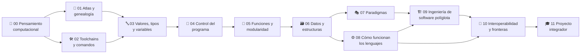

<div align="center">

# 🌐 Polyglot Programming Labs

## **12 partes · 176 clases · 1360 implementaciones verificadas · un concepto, diez lenguajes**

**Programa comparado y verificable para aprender los conocimientos transferibles de la
programación: pensamiento computacional, valores y tipos, control, funciones, datos,
paradigmas, runtime, ingeniería, interoperabilidad y un proyecto integrador —
cada concepto mostrado una vez y comparado en Python, JavaScript, TypeScript, Java,
C#, Go, Rust, C, SQL y PHP, con un Atlas que te deja leer decenas de lenguajes más.**

[](https://github.com/vladimiracunadev-create/polyglot-programming-labs/actions/workflows/ci.yml)
[](https://github.com/vladimiracunadev-create/polyglot-programming-labs/actions/workflows/labs.yml)
[](https://github.com/vladimiracunadev-create/polyglot-programming-labs/actions/workflows/security.yml)
[](https://github.com/vladimiracunadev-create/polyglot-programming-labs/actions/workflows/deploy-pages.yml)

[](classes/README.md)
[](languages.json)
[](scripts/verificar_equivalencia.py)
[](atlas/README.md)
[](classes/README.md)
[](LICENSE)

[](classes/README.md)
[](classes/README.md)
[](classes/README.md)
[](classes/README.md)
[](classes/README.md)
[](classes/README.md)
[](classes/README.md)
[](classes/README.md)
[](classes/README.md)
[](classes/README.md)
[](https://vladimiracunadev-create.github.io/polyglot-programming-labs/)

[🌐 **Sitio del curso (vivo)**](https://vladimiracunadev-create.github.io/polyglot-programming-labs/) ·
[📚 Índice de clases](classes/README.md) ·
[🌐 Atlas](atlas/README.md) ·
[🧭 Rutas](rutas/README.md) ·
[📖 Glosario](glosario/README.md) ·
[📕 Manual PDF](manual/MANUAL.pdf) ·
[📅 Syllabus](docs/syllabus.md) ·
[🗺️ Roadmap](ROADMAP.md) ·
[🤝 Contribuir](CONTRIBUTING.md) ·
[🔐 Seguridad](SECURITY.md)

<br>

| 📘 Clases | 🌐 Implementaciones | 🧬 Primos | 🧩 Partes | 📖 Glosario | 📝 Preguntas |
|:---:|:---:|:---:|:---:|:---:|:---:|
| **176** | **1360** | **2722** | **12** | **424** | **90** |

</div>

---

> [!IMPORTANT]
> Este repositorio **no reemplaza** los cursos de cada lenguaje. Es el mapa de lo que
> **permanece** al cambiar de lenguaje. `Fluent Python`, `Effective Java`,
> `The Rust Programming Language` y compañía aparecen como referencias de profundización
> en cada clase, sin copiar ni falsear su contenido: la redacción aquí es original.

## ✅ Estado verificable

| Superficie | Estado |
|---|---|
| Currículo | ✅ 176/176 clases construidas — 136 de código (Partes 3–11) y 40 de método (Partes 0–2) |
| Implementaciones | ✅ 1360 del núcleo (136 clases × 10 lenguajes), con el código a la vista en la clase |
| Equivalencia | ✅ verificada en CI: cada implementación se ejecuta contra el `casos.json` de su clase |
| Primos del Atlas | 🟡 2722 programas en 20 lenguajes; Ruby, Perl y Lua se **ejecutan** en CI, los otros 17 son lectura declarada |
| Atlas de familias | ⚪ 39 cápsulas en 15 familias — material de lectura fechado (rev. 2026-07); no se ejecuta |
| Manual | ✅ ~1306 páginas en PDF, generadas desde las mismas clases |
| Glosario | ✅ 424 términos derivados de las clases y enlazados a su clase de origen |
| Autoevaluaciones | ✅ 90 preguntas, batería por cada una de las 12 partes |
| Sitio | ✅ portal estático en GitHub Pages con índice, búsqueda y rutas |
| CI | ✅ estructura y manifest, markdownlint, equivalencia por lenguaje, secretos (gitleaks) y SAST (bandit) |
| SQL | ⚪ declarativo: se marca como *ilustrativo* en el verificador, no se fuerza a imitar un lenguaje imperativo |

## 🌟 Qué hace diferente a este programa

- Enseña el **concepto una vez** y luego lo compara: la pregunta no es "¿cómo se escribe en X?", sino **"¿qué permanece y qué cambia —y por qué— al pasar de un lenguaje a otro?"**.
- La equivalencia entre lenguajes **la demuestra una máquina**, no una promesa del texto: mismo `casos.json`, mismas salidas, en CI.
- Distingue siempre las **tres clases de diferencia**: sintáctica, semántica y paradigmática — la mayoría de los cursos mezclan las tres.
- Separa el **núcleo** (se implementa y se verifica) del **Atlas** (se comprende por características), y no vende lo segundo como lo primero.
- Ancla cada parte en la **literatura de referencia** de su área, con la cita en la clase.
- Declara sin adornos **qué verifica la máquina y qué es material de lectura**.

## 🧬 El mapa del programa



## 🗂️ Las 12 partes, en 5 etapas

Cada parte tiene su **propio README docente**, y no un índice de enlaces: de qué trata,
qué necesitas traer, qué sabrás hacer al terminar, **qué se aprende en cada una de sus
clases** agrupadas por bloques, los malentendidos que corrige y los libros que la
sostienen. La numeración es **global y secuencial** por diseño: lo que enseña cada parte
es el prerrequisito real de la siguiente.

### 🟢 Etapa 1 — Método y mapa *(clases de método)*

Cómo se compara un lenguaje con otro, de dónde vienen todos y con qué se ejecutan.
**Salida: leer código de un lenguaje que no conoces.**

| # | Parte | Clases | Rango | Tipo | Horas |
|---:|---|---:|---|---|---:|
| 0 | [🧠 Pensamiento computacional y el método políglota](classes/parte-0-pensamiento-computacional-y-el-metodo-poliglota/README.md) | 14 | 001–014 | método | ~21 |
| 1 | [🌳 Atlas y genealogía de los lenguajes](classes/parte-1-atlas-y-genealogia-de-los-lenguajes/README.md) | 14 | 015–028 | método | ~21 |
| 2 | [🛠️ Herramientas, toolchains y anatomía de comandos](classes/parte-2-herramientas-toolchains-y-anatomia-de-comandos/README.md) | 12 | 029–040 | método | ~18 |

### 🔵 Etapa 2 — El programa elemental

Los tres ladrillos que todo lenguaje tiene: qué es un valor, cómo se decide y cómo se
nombra un bloque de trabajo. **Salida: escribir el mismo programa correcto en diez lenguajes.**

| # | Parte | Clases | Rango | Tipo | Horas |
|---:|---|---:|---|---|---:|
| 3 | [🔤 Valores, tipos y variables](classes/parte-3-valores-tipos-y-variables/README.md) | 16 | 041–056 | código | ~40 |
| 4 | [🔀 Control del programa](classes/parte-4-control-del-programa/README.md) | 16 | 057–072 | código | ~40 |
| 5 | [🧩 Funciones y modularidad](classes/parte-5-funciones-y-modularidad/README.md) | 16 | 073–088 | código | ~40 |

### 🟣 Etapa 3 — Datos y paradigmas

De guardar un dato a elegir un estilo de resolver: OO, funcional, declarativo, concurrente.
**Salida: reconocer el paradigma detrás de una API y su coste.**

| # | Parte | Clases | Rango | Tipo | Horas |
|---:|---|---:|---|---|---:|
| 6 | [🗃️ Datos y estructuras](classes/parte-6-datos-y-estructuras/README.md) | 18 | 089–106 | código | ~45 |
| 7 | [🎭 Paradigmas](classes/parte-7-paradigmas/README.md) | 16 | 107–122 | código | ~40 |

### 🟠 Etapa 4 — Máquina e ingeniería

Qué ocurre bajo el código (memoria, GC, propiedad, compilación) y cómo se construye
software que otros mantienen. **Salida: explicar el porqué, no solo el cómo.**

| # | Parte | Clases | Rango | Tipo | Horas |
|---:|---|---:|---|---|---:|
| 8 | [⚙️ Cómo funcionan los lenguajes](classes/parte-8-como-funcionan-los-lenguajes/README.md) | 16 | 123–138 | código | ~40 |
| 9 | [🏗️ Ingeniería de software políglota](classes/parte-9-ingenieria-de-software-poliglota/README.md) | 16 | 139–154 | código | ~40 |

### 🔴 Etapa 5 — Fronteras y proyecto

Dónde se tocan dos lenguajes distintos y el trabajo que junta las once partes anteriores.
**Salida: montar un sistema real con más de un lenguaje y defenderlo.**

| # | Parte | Clases | Rango | Tipo | Horas |
|---:|---|---:|---|---|---:|
| 10 | [🔌 Interoperabilidad y fronteras entre lenguajes](classes/parte-10-interoperabilidad-y-fronteras-entre-lenguajes/README.md) | 10 | 155–164 | código | ~25 |
| 11 | [🎓 Proyecto integrador políglota](classes/parte-11-proyecto-integrador-poliglota/README.md) | 12 | 165–176 | proyecto | ~36 |

➡️ **[Ver el índice completo de las 176 clases](classes/README.md)** · 📅 **[Cronograma de ~406 h / ~41 semanas](docs/syllabus.md)**

## 🚀 Inicio rápido

```bash
git clone https://github.com/vladimiracunadev-create/polyglot-programming-labs.git
cd polyglot-programming-labs

python scripts/validar_estructura.py            # el repo cuadra con el manifest
python scripts/verificar_equivalencia.py 041    # una clase, en todos los lenguajes instalados
python scripts/verificar_equivalencia.py --all --lang go   # solo un lenguaje, todas las clases
```

No hace falta instalar nada más para **leer**: cada clase muestra el código de los diez
lenguajes a la vista, en su `README.md`.

Sitio local:

```bash
python scripts/generar_sitio.py && python -m http.server 8080
```

Abre `http://localhost:8080/site/`.

## 🧪 El verificador de equivalencia

El diferenciador del programa: cada clase de código define un `casos.json` (entradas y
salidas comunes), y el verificador ejecuta **todas** las implementaciones alimentándolas
por stdin para comprobar que **coinciden**. No es teoría: es equivalencia demostrada por
máquina, en paralelo por lenguaje en CI.

```bash
python scripts/verificar_equivalencia.py 041            # una clase
python scripts/verificar_equivalencia.py --all          # todas las clases
python scripts/verificar_primos.py --all --lang ruby    # los primos del Atlas que sí se ejecutan
```

Los lenguajes cuyo toolchain no esté instalado se **omiten e informan** (degradación
silenciosa, nunca un falso verde); SQL, al ser declarativo, se marca como *ilustrativo*.

## 📕 Manual completo en PDF

El mismo contenido de las clases, en un solo documento con portada e índice enlazado y
**con el código de los diez lenguajes a la vista** — que es lo que hace que valga la pena
en papel: se comparan sin saltar entre archivos.

- 📥 **[Manual completo (~1306 páginas)](manual/MANUAL.pdf)** — listo para imprimir o leer offline.

```bash
python scripts/generar_manual.py               # regenera el manual desde las clases
python scripts/generar_manual.py --con-primos  # incluye los 2722 programas primos
python scripts/generar_material.py --parte 3   # guías sueltas por clase en material/ (no se versionan)
```

## 📦 Contrato de una clase

```text
classes/parte-N-slug/NNN-topic/
├── README.md            ← la clase completa, con el código de los 10 lenguajes a la vista
├── concepto.md
├── comparacion.md       ← sintáctica · semántica · paradigmática
├── reto.md              ← reto de transferencia
├── primos.md            ← el mismo programa en los lenguajes primos de cada familia
├── casos.json           ← la prueba común que ejecuta el verificador
└── implementaciones/<lenguaje>/...
```

Dentro del `README.md` de cada clase: 🎯 objetivo y resultados verificables · 🗺️ temas con
su porqué · 📖 definiciones · 🧮 modelo (entradas/salidas/reglas) · 📐 pseudocódigo neutral ·
🌐 las 10 implementaciones · 🔬 comparación · 🧬 el concepto en la familia · ✅ prueba común ·
🧪 reto · ⚠️ errores comunes · ❓ FAQ · 🔗 referencias a los libros del área y del lenguaje.

## 📚 Pauta derivada de los mejores libros

El contenido no sale de una plantilla: cada parte sigue la literatura de referencia de su
tema. Estas son las obras que sostienen el programa (**no se reproduce su contenido**; la
redacción es original y cada clase cita el libro correspondiente).

| Área | Libros de referencia |
|---|---|
| **Pensamiento y algoritmos** | Polya — *How to Solve It* · Abelson/Sussman — *SICP* · Cormen et al. — *Introduction to Algorithms* · Hunt/Thomas — *The Pragmatic Programmer* |
| **Lenguajes y paradigmas** | Sebesta — *Concepts of Programming Languages* · Scott — *Programming Language Pragmatics* · Van Roy/Haridi — *Concepts, Techniques, and Models…* · Tate — *Seven Languages in Seven Weeks* |
| **Tipos y semántica** | Pierce — *Types and Programming Languages* · Dahl/Dijkstra/Hoare — *Structured Programming* |
| **Datos y estructuras** | Cormen et al. — *Introduction to Algorithms* · Sedgewick/Wayne — *Algorithms* |
| **Runtime y compilación** | Nystrom — *Crafting Interpreters* · Aho et al. — *Compilers* («Dragon Book») · Bryant/O'Hallaron — *Computer Systems: A Programmer's Perspective* |
| **Ingeniería de software** | McConnell — *Code Complete* · Martin — *Clean Code* · Fowler — *Refactoring* · Gamma et al. — *Design Patterns* (GoF) · Beck — *TDD by Example* |
| **Interoperabilidad y sistemas** | Kleppmann — *Designing Data-Intensive Applications* · Newman — *Building Microservices* · Tanenbaum — *Distributed Systems* · Nygard — *Release It!* |
| **Toolchains y entorno** | Shotts — *The Linux Command Line* · Kernighan/Pike — *The Unix Programming Environment* |
| **Por lenguaje (núcleo)** | Ramalho — *Fluent Python* · Bloch — *Effective Java* · Donovan/Kernighan — *The Go Programming Language* · Klabnik/Nichols — *The Rust Programming Language* · Kernighan/Ritchie — *K&R* · Haverbeke — *Eloquent JavaScript* · Cherny — *Programming TypeScript* · Skeet — *C# in Depth* · Date — *SQL and Relational Theory* · Lockhart — *Modern PHP* |

## 🧩 Núcleo y Atlas: dos capas

| Capa | Qué es | Alcance |
|---|---|---|
| **Núcleo** | Se implementa, se muestra a la vista y **se verifica en CI** | Python, JavaScript, TypeScript, Java, C#, Go, Rust, C, SQL, PHP |
| **Atlas** | Se **comprende por características** (historia, paradigma, memoria, toolchain) | 39 cápsulas en 15 familias: Ruby, Kotlin, Haskell, Clojure, Prolog, Zig, Lua, Scala, Dart… |

La idea: **aprende el representante, reconoce la familia entera.** Si dominas C, ya lees el
80 % de la sintaxis de Java, C#, JS, Go y PHP. El **[Atlas](atlas/README.md)** cubre esa
amplitud sin multiplicar el mantenimiento.

### 🧬 Los primos: el mismo programa en toda la familia

Cada muestra de código del núcleo enlaza, justo debajo, a las versiones del **mismo programa**
en los lenguajes primos de su familia. Si lees el bloque de Python, ves de inmediato cómo lo
escribirían Ruby, Perl, Lua, Tcl o R:

```markdown
🧬 El mismo programa en la familia Scripting dinámico: Ruby · Perl · Lua · Tcl · R
```

Son **2722 programas en 20 lenguajes**, y lo que da valor a cada página no es el código sino
el párrafo *«Qué reconocer»* que la cierra: que `0` es verdadero en Lua y Clojure, que Lua
hace herencia por `__index` —el mismo modelo de prototipos de JavaScript—, o que el
*name mangling* de C++ no está estandarizado entre compiladores.

Ruby, Perl y Lua **se ejecutan en CI** contra el mismo `casos.json` que el núcleo
([workflow Labs](.github/workflows/labs.yml)); los otros 17 primos son material de lectura y
así se declara en cada página. Verificar tres de veinte no es verificarlos todos.

## 🧭 Portal

- 🧭 **[Rutas por perfil](rutas/README.md)** — "vengo de Python", "quiero sistemas (C/Rust)", "web (JS/TS)", "backend (Java/C#/Go)", "datos (SQL)".
- 🌐 **[Atlas de lenguajes](atlas/README.md)** — genealogía, historia, características y toolchain de cada familia.
- 📝 **[Autoevaluaciones](autoevaluaciones/README.md)** — 90 preguntas, una batería por parte, con quiz y progreso local.
- 📖 **[Glosario](glosario/README.md)** — 424 términos enlazados a la clase donde se explican.
- 🧪 **[Laboratorios](labs/README.md)** — la equivalencia demostrada: el verificador sobre las implementaciones.

🌐 Todo navegable en el **[sitio del curso](https://vladimiracunadev-create.github.io/polyglot-programming-labs/)** (GitHub Pages).

## 👩‍🏫 Para instructores

- 📅 **[Syllabus y cronograma](docs/syllabus.md)** — horas por parte, dependencias y un plan de ~41 semanas.
- 📊 **[Rúbrica de evaluación](docs/rubrica-evaluacion.md)** — cómo puntuar retos de transferencia, laboratorios y el proyecto integrador.
- 🎓 **[Examen final por perfil](docs/examen-final-por-perfil.md)** — teoría + transferencia verificada + explicación, para cada ruta.
- 🧱 **[Currículo](docs/CURRICULO.md)** · **[Metodología](docs/METODOLOGIA.md)** · **[Ampliar lenguajes](docs/EXTENDER.md)**.

## 🗂️ Estructura del repositorio

```text
classes/
  _manifest.json          # fuente de verdad (176 clases)
  README.md               # índice completo
  parte-N-.../
    README.md             # README de la parte (con sus libros de referencia)
    NNN-.../              # la clase (ver «Contrato de una clase»)
atlas/  rutas/  autoevaluaciones/  glosario/  labs/
manual/  material/  docs/  site/
scripts/  .github/workflows/
```

Todo deriva de [`classes/_manifest.json`](classes/_manifest.json), producido por
[`scripts/build.py`](scripts/build.py) a partir de [`scripts/curriculo.py`](scripts/curriculo.py).
Re-ejecutar `python scripts/build.py` actualiza índice y README sin pisar el contenido escrito a mano.

## 🚀 Cómo estudiar

```text
problema → concepto → pseudocódigo → implementaciones → comparación → transferencia
```

1. **Sigue el orden.** Empieza por la [Parte 0](classes/parte-0-pensamiento-computacional-y-el-metodo-poliglota/README.md), que fija el método de comparación.
2. **Lee las 10 implementaciones, no solo la de tu lenguaje.** El valor está en el contraste: ahí se ve qué es esencial y qué es accidente de la sintaxis.
3. **Ejecuta el verificador.** Comprueba tú mismo la equivalencia, y observa en qué se diferencian las salidas cuando fuerzas un caso límite.
4. **Haz el reto de transferencia.** Portar el concepto a un lenguaje que no dominas es donde se fija el aprendizaje.
5. **Usa los libros de referencia** de cada parte para profundizar en lo que más te interese.

## 🔗 Programas conectados

| Programa | Rol |
|---|---|
| [Problem-Driven Systems Lab](https://github.com/vladimiracunadev-create/problem-driven-systems-lab) | Los mismos lenguajes, ya en producción: 12 problemas reales resueltos en 7 stacks |
| [Computational Mathematics Program](https://github.com/vladimiracunadev-create/computational-mathematics-program) | La matemática y los algoritmos que las clases de datos y complejidad asumen |
| [Python Data Science Program](https://github.com/vladimiracunadev-create/python-data-science-program) | Profundizar en uno de los diez: Python aplicado a datos, ML y MLOps |
| [AI Evolution Program](https://github.com/vladimiracunadev-create/artificial-intelligence-evolution-program) | La evolución de la IA, con el mismo criterio de material verificable |

## ⚖️ Qué es y qué no es este programa

<table>
<tr>
<td valign="top" width="50%">

### ✅ Lo que sí es

- 🧬 un **currículo comparado completo**: 176 clases donde cada concepto se enseña una vez y se contrasta entre diez lenguajes;
- 🧪 material **ejecutable y verificable**: 1360 implementaciones que CI corre contra un `casos.json` común hasta que coinciden;
- 📖 contenido **abierto y gratuito en español**, legible en GitHub, en el sitio del curso o en un manual de ~1306 páginas;
- 🌐 una capa de **amplitud honesta**: el Atlas explica ~40 lenguajes por sus características, sin fingir que se implementan;
- 🔍 material **honesto sobre sus límites**: cada página declara si lo que lees se ejecuta o se lee.

</td>
<td valign="top" width="50%">

### ❌ Lo que no es

- 🚫 una certificación: completar clases no acredita experiencia profesional en ninguno de los diez lenguajes;
- 🚫 diez cursos en uno: no sustituye a un curso a fondo de Rust o de SQL — enseña lo que se transfiere entre ellos;
- 🚫 un curso de frameworks: no hay React, Spring ni Django; el objeto de estudio es el lenguaje, no su ecosistema;
- 🚫 verificación total: 17 de los 20 primos del Atlas son lectura, y el texto de las clases lo escribe una persona, no CI;
- 🚫 la afirmación de que "todos los lenguajes son iguales": el programa existe justamente para explicar en qué no lo son.

</td>
</tr>
</table>

## 💡 Idea fuerza

> El valor de este programa no está en acumular lenguajes, sino en **separar lo que se
> transfiere de lo que es accidente de sintaxis**: cada clase produce el mismo resultado
> en diez lenguajes, demuestra por máquina que son equivalentes, y luego explica en qué
> se diferencian de verdad. Aprender el undécimo lenguaje deja de ser empezar de cero.

## Principios

- Comparar conceptos, no solo sintaxis.
- Anclar el contenido en los **libros de referencia** de cada área.
- Mantener el mismo problema, datos de prueba y resultado esperado en todos los lenguajes.
- Explicar diferencias reales sin declarar que todos los lenguajes son iguales.
- Distinguir siempre lo que verifica la máquina de lo que es material de lectura.
- Crecer por conceptos, no por cursos aislados.
- Usar `pnpm` en todo componente JavaScript/TypeScript que requiera paquetes.

## 🧪 Calidad

```bash
python scripts/validar_estructura.py
python scripts/build.py --stats
python scripts/verificar_equivalencia.py --all
npx --yes markdownlint-cli2 "**/*.md"
```

## 🤝 Contribuir y seguridad

Lee la [guía de contribución](CONTRIBUTING.md) y la [política de seguridad](SECURITY.md).
El repositorio escanea secretos con `gitleaks` y el tooling con `bandit` en cada push.

## 📄 Licencia

Código y documentación original bajo [MIT](LICENSE). Los libros, lenguajes, toolchains y
servicios externos citados conservan sus propias licencias y términos.

---

<div align="center">

**Hecho para quien quiere entender la programación entera, no solo su lenguaje favorito.**

[⬆️ Empezar por la clase 001](classes/parte-0-pensamiento-computacional-y-el-metodo-poliglota/001-que-es-programar-y-por-que-comparar-lenguajes-la-tesis-poliglota/README.md) ·
[🌐 Sitio del curso](https://vladimiracunadev-create.github.io/polyglot-programming-labs/) ·
[📖 Glosario](glosario/README.md) ·
[📕 Manual completo en PDF](manual/MANUAL.pdf) ·
[🗺️ Roadmap](ROADMAP.md)

<br>

**¿Te resulta útil? ⭐ Dale una estrella al repo.**

[](https://github.com/vladimiracunadev-create/polyglot-programming-labs/stargazers)
[](https://github.com/vladimiracunadev-create/polyglot-programming-labs/network/members)
[](https://github.com/vladimiracunadev-create)

Hecho con 🌐 y ☕ por [Vladimir Acuña](https://github.com/vladimiracunadev-create)

</div>
